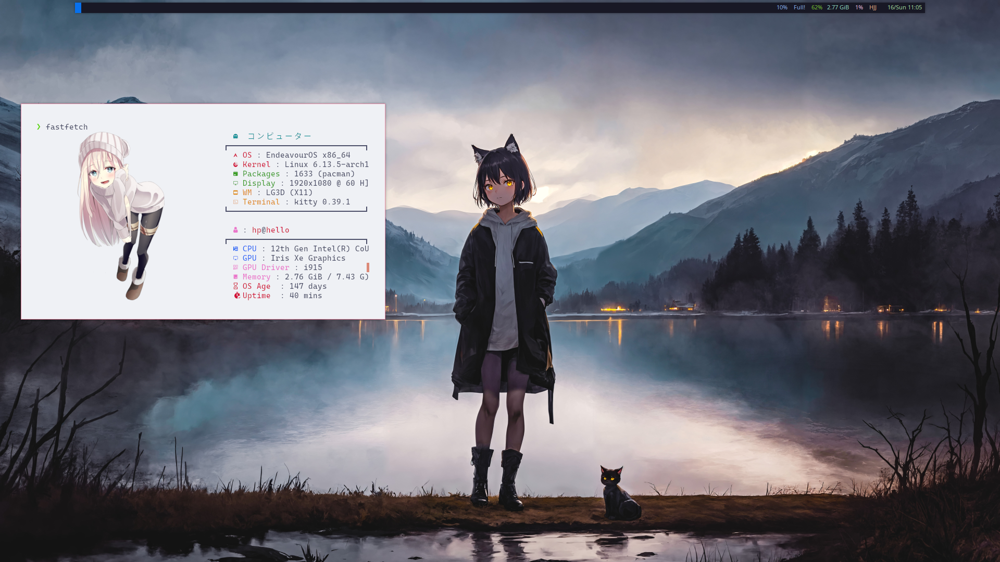

# Dotfiles

This repository contains my personal dotfiles for my Linux desktop environment. The configuration focuses on a minimal, efficient workflow using xmonad as the window manager along with carefully configured supporting applications.



## Overview

This setup includes configuration files for:

- **xmonad** - A tiling window manager configured for productivity
- **kitty** - A fast, feature-rich terminal emulator
- **picom** - Compositor for X11 providing visual effects and transparency
- **polybar** - A highly customizable status bar

## Installation

### Prerequisites

Make sure you have the following packages installed:

```bash
# Arch Linux / Manjaro
sudo pacman -S xmonad xmonad-contrib kitty picom polybar

# Debian / Ubuntu
sudo apt install xmonad libghc-xmonad-contrib-dev kitty picom polybar
```

### Cloning and Setup

1. Clone this repository to your home directory:

```bash
git clone https://github.com/yourusername/dotfiles.git ~/.dotfiles
```

2. Create symbolic links for the configuration files:

```bash
# Create necessary directories if they don't exist
mkdir -p ~/.config/xmonad
mkdir -p ~/.config/kitty
mkdir -p ~/.config/picom
mkdir -p ~/.config/polybar

# Create symlinks
ln -sf ~/dotfiles/xmonad/xmonad.hs ~/.config/xmonad/
ln -sf ~/dotfiles/kitty/kitty.conf ~/.config/kitty/
ln -sf ~/dotfiles/picom/picom.conf ~/.config/picom/
ln -sf ~/dotfiles/polybar/config ~/.config/polybar/
```

3. Restart or reload your window manager to apply changes

## Configuration Details

### xmonad

The xmonad configuration prioritizes workspace management and efficient keyboard shortcuts. Key features include:

- Custom workspace layouts
- Application-specific rules
- Productivity-focused keybindings

To recompile xmonad after changes:

```bash
xmonad --recompile && xmonad --restart
```

### kitty

A modern terminal emulator configured for:

- Custom color scheme matching the desktop theme
- Font configuration optimized for development
- Performance tweaks for smooth operation

### picom

Compositor configuration focusing on:

- Subtle window shadows
- Transparency effects for inactive windows
- Smooth animations without performance impact

### polybar

Status bar configuration with:

- System resource monitoring
- Workspace indicators
- Network and battery status
- Custom modules for enhanced workflow

## Keybindings

| Shortcut | Action |
|----------|--------|
| Super + Shift + Enter | Open terminal |
| Super + Shift + C | Close window |
| Super + Shift + Q | Quit xmonad |
| Super + Space | Change layout |
| Super + Shift + Space | Reset layout |
| Super + [F1-F9] | Switch to workspace |
| Super + Shift + [F1-F9] | Move window to workspace |

## Customization

Feel free to modify any of these configuration files to suit your preferences. The modular structure makes it easy to experiment with different settings.

## License

This project is licensed under the MIT License - see the [LICENSE](LICENSE) file for details.

## Acknowledgments

- The xmonad community for documentation and examples
- Various themes and configurations that provided inspiration

## Contact

If you have any questions or suggestions, feel free to open an issue or reach out to me directly.
